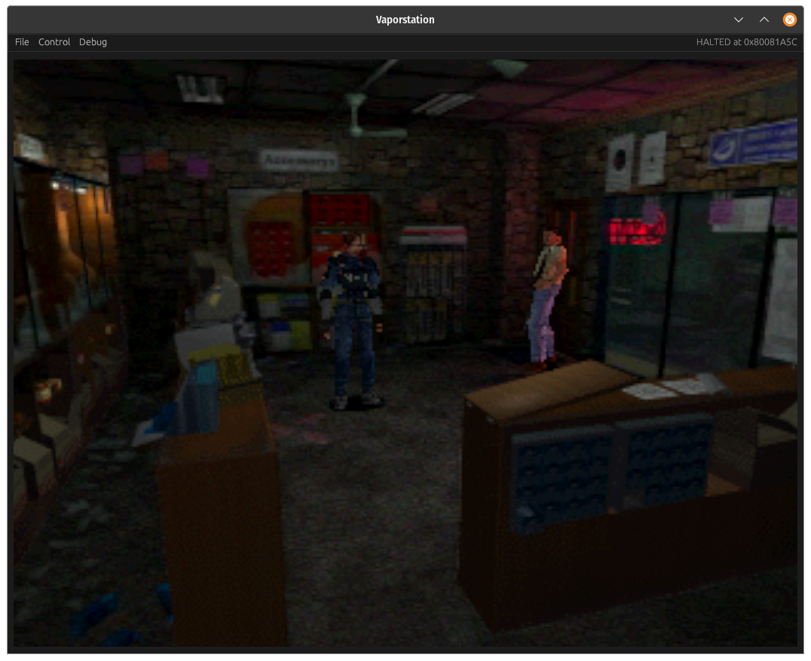
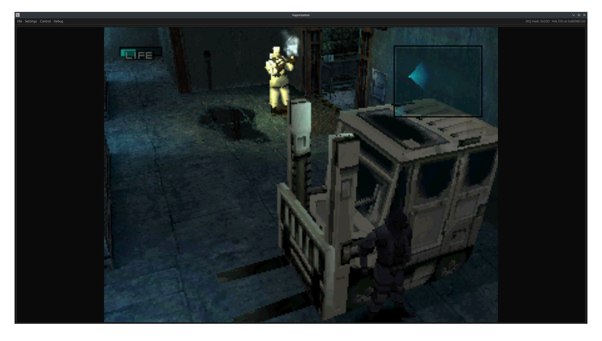

# VaporStation
A toy playstation 1 emulator written in rust. Capable of emulating most of the playstation's hardware components and playing some retail games.

## OS Support

|    OS   |      Supported     |                   Notes                                |
|---------|--------------------|--------------------------------------------------------|
|  Linux  | :heavy_check_mark: |          Main development target                       |
| Windows | :heavy_check_mark: |          Tested on Windows 10 Desktop                  |
|  macOS  | :heavy_check_mark: |          Tested on M1 Macbook Pro                      |

## Software Support

### BIOS

| Version      | Status             |
|--------------|--------------------|
| SCPH1001     | :heavy_check_mark: |
| SCPH7001     | :heavy_check_mark: |
| openbios     | :heavy_check_mark: |

### Retail games

See [compatibility.md](docs/compatibility.md)

## Building

Run `cargo build --release` from ./desktop to build the emulator core and desktop client.

## Operating Instructions

### Command line options

| Flag | Meaning                                                     |
|------|-------------------------------------------------------------|
| -c   | Path of cue file to load                                    |
| -e   | Path of ps-exe to load                                      |
| -b   | Path of alternate BIOS file. Defaults to ` ./SCPH1001.bin ` |
| -g   | Enable GDB debugging on port 4444                           |
| -l   | Enable verbose logging                                      |
| -h   | Run emulator in headless mode                               |

### Example command

Run crash bandicoot with a local copy of openbios

` vaporstation -c ~/Games/crash_bandicoot.cue -b ./openbios.bin `

### GUI options

| Option                 | Meaning                                        |
|------------------------|------------------------------------------------|
| File->Quit             | Close emulator                                 |
| Control->Halt          | Pause emulation (Only visible if running)      |
| Control->Continue      | Continue emulation (Only visible if paused)    |
| Control->Frame Limiter | Toggle 60fps frame limiter. Enabled by default |
| Debug->VRAM Viewer     | Opens VRAM viewer window                       |
| Debug->GPU Call Debug  | Opens GPU call debugger window                 |
| Debug->Memory Logging  | Toggles logging memory access to stdout        |

### BIOS
The Playstation depends software called the BIOS to boot user programs. Being a full emulator, Vaporstation also requires a BIOS binary. By default, Vaporstation expects a BIOS file at ` ./SCPH1001.bin `, but an alternative file can be loaded with the ` -b <BIOS path>` option. To legally obtain a BIOS binary, you need to dump the firmware from a real playstation's rom chip. For an open source implementation of the BIOS, see [openbios](https://github.com/grumpycoders/pcsx-redux/tree/main/src/mips/openbios).

### Loading software
Software written for the playstation can be loaded via two methods. From a ps-exe file or a CD image.

Executables can be loaded from a file with the ` -e <Executable Path>` option. Please note that although they share the same file extension, playstation executables are not windows executables. Attempting to load a windows executable will not work. The given ps-exe will be copied into memory at the entrypoint defined in the executable header and jumped to once the BIOS has finished initializing the machine. 

Retail or homebrew CD images can be inserted into the virtual CD drive with the ` -c <CUE File Path>` option. Only bin/cue file pairs work with Vaporstation. ISO support is not currently planned. Vaporstation does not implement region locking or DRM checks, so most discs should work.

### Logging
By default, all data sent to the playstation's serial port will be echoed to stdout. To enable verbose logging about internal emulator state, use the ` -l ` command line flag. All verbose logging will also be sent to stdout.

### Headless mode

Passing the ` -h ` flag will start Vaporstation in headless mode. In headless mode the GUI is not shown and the frame limiter is disabled. This mode is useful for running test programs.

### GDB debugging
Vaporstation supports a small subset of the GDB protocol. Pass the ` -g ` flag at launch and Vaporstation will wait for a GDB connection at port ` 4444 ` after initialization. Breakpoints, instruction stepping and memory/register access are implemented. Be careful when stepping the CPU because going too far without resuming execution can cause the processor to fall out of sync with the rest of the system. Debugging works in both GUI and headless mode

### GPU call debugger
This tool displays a list of every gpu call that has been sent during the current frame. Selecting a specific gpu call will show which area of VRAM was affected by the call.

Tip: Use this in conjunction with the VRAM viewer. Because most games use double buffering, any GPU calls probably won't be touching the displayed screen area.

## Technical Details

In an effort to make Vaporstation portable, the emulation core and frontend interface are implemented as two separate components. The emulation core handles system emulation while the client loads input files, handles input, and renders emulator output to the display. To port Vaporstation to a new platform, one only needs to create a new client application.

### Emulation core

Vaporstation implements software recreations of the original playstation hardware components. Most peripherals are memory mapped and are accessed via the emulated memory bus. The only exception is the GTE, which is a CPU coprocessor.

- MIPS R3000 CPU
- Memory (RAM)
- Video Memory (VRAM)
- BIOS ROM
- Timers
- Graphics processor (GPU)
- CDROM drive
- Matrix multiplication accelerator (GTE)

### Desktop client

Currently, the only client available is the basic desktop client. This client supports all current features of Vaporstation, and is built on the cross platform GUI framework [egui + eframe](https://github.com/emilk/egui).

The desktop client is split into two threads to isolate the gui rendering speed from the emulator core. Message passing is used to send input and commands from the GUI to the emulator, and state changes from the emulator back to the GUI.
